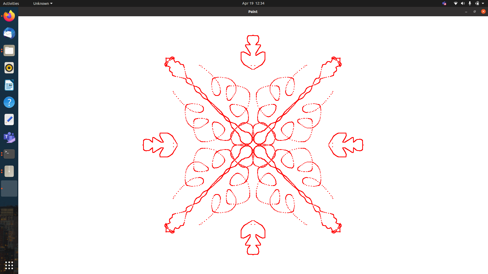
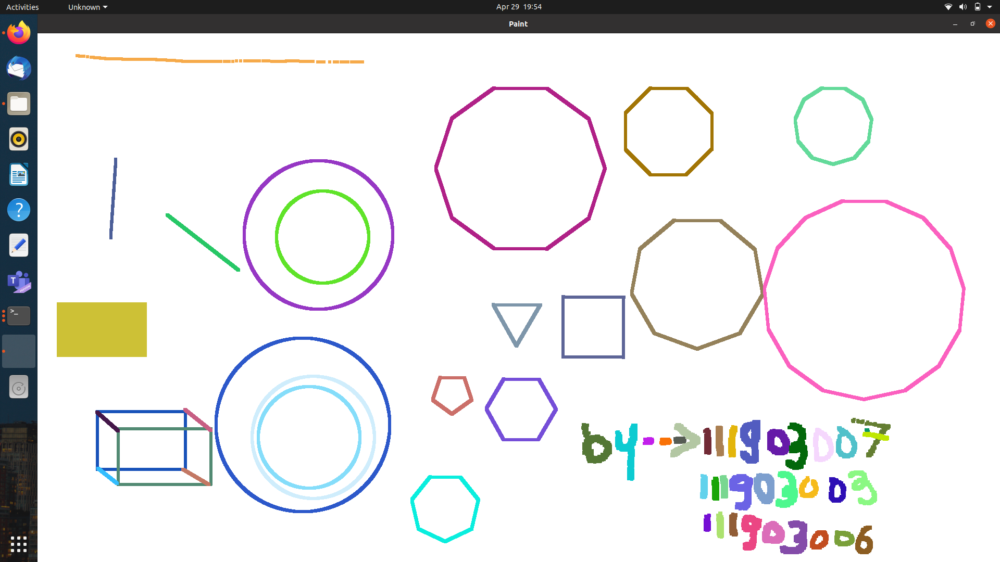

# Paint – Shapes Editor Using OOPs and OpenGL in C++

## 📌 Overview
This project is a **Shapes Editor/Paint application** implemented in **C++** using OpenGL and GLUT.  
It provides an interactive interface to draw and manipulate shapes such as:
- Rectangle, Square, Circle, Ellipse, Triangle
- Polygons (up to 20 edges — converging towards a circle after 20 edges)
- Airbrush and Radial Brush features
- Pixel size adjustments
- Color fill and border customization

**Key OOP Features Used:**
- **Inheritance** – Base classes like `Point`, `Line`, `Polygon`, and `Shape` extended by specific shape classes.
- **Encapsulation** – Shape properties (position, size, color) with methods to manipulate them.
- **Polymorphism** – Uniform handling of different shapes through base class interfaces.

---

## 📂 Project Structure
```
├── main.cpp
├── point.cpp / point.h
├── line.cpp / line.h
├── shapes.cpp / shapes.h
├── polygon.cpp / polygon.h
├── curve.cpp / curve.h
├── Makefile
└── Output/
```

## ⚙️ Setup Instructions

### 1️⃣ Install Dependencies
Ensure you have:
- **g++** (C++11 or later)
- **OpenGL** and **GLUT** libraries

On Ubuntu/Debian:
```bash
sudo apt update
sudo apt install g++ freeglut3-dev
```

### 2️⃣ Build the Application
```bash
make
```

### 3️⃣ Run the Application
```bash
./Paint
```

🖱️ Controls

### Mouse
- **Draw and select shapes** by clicking and dragging.

### Keyboard
- `q` or `ESC` → Quit application  
- `+` → Increase shape size  
- `-` → Decrease shape size  
- Shape-specific key bindings → Refer to code for more details

---

## 📸 Screenshots

| Radial Brush | Polygon Drawing |
|--------------|----------------|
|  |  |


